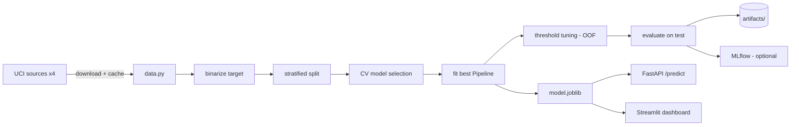

# CardioRisk — Heart Disease Risk Prediction

[](https://github.com/amunim12/CardioRisk/actions/workflows/ci.yaml)
[](https://www.python.org/)
[](https://github.com/astral-sh/ruff)
[](LICENSE)

A reproducible, MLOps-grade system that predicts whether a person is at risk of
heart disease from routine clinical measurements. It takes the classic
"Heart Disease UCI" assignment and builds it the way you'd ship a real model:
a modular package, a leak-free pipeline, honest evaluation framed for a medical
context, three flavours of feature importance, a serving API, a dashboard,
containers, tests, and CI.

> **Clinical framing:** a missed at-risk patient (false negative) is the costly
> error, so the decision threshold is tuned for **recall/sensitivity**, not the
> default 0.5. See [`MODEL_CARD.md`](MODEL_CARD.md).

## Highlights

- **Data:** the full UCI combined dataset (~920 rows from Cleveland, Hungary,
  Switzerland, VA Long Beach) with *real* missing values — not the trivial
  303-row single-file export.
- **Leak-free pipeline:** all imputation/scaling/encoding lives inside a
  scikit-learn `Pipeline`, fitted only on training folds and serialised whole
  (no train/serve skew).
- **Model selection:** Logistic Regression (interpretable), Decision Tree
  (rule view), and HistGradientBoosting (accuracy benchmark) compared under
  stratified 5-fold CV.
- **Evaluation:** accuracy, precision, recall, F1, ROC-AUC, PR-AUC + ROC curve,
  confusion matrix, calibration curve, and recall-oriented threshold tuning.
- **Explainability:** permutation importance (always on), logistic coefficients,
  and SHAP (optional, gracefully skipped if unavailable).
- **Serving:** FastAPI service (`/health`, `/predict`) + a Streamlit dashboard.
- **Engineering:** typed config, pytest suite, ruff + mypy, pre-commit,
  GitHub Actions CI, Docker + docker-compose, optional MLflow tracking.

## Architecture



## Why Docker?

This project was developed on Windows with **Smart App Control** enabled, which
blocks unsigned native wheels (numpy/scipy/scikit-learn) from loading. Running
inside a Linux container side-steps that policy entirely and makes the build
reproducible on any host. Docker is therefore the supported way to run the
pipeline; a local `pip install` works wherever native wheels are permitted.

## Quickstart (Docker)

```bash
# 1. Build the image (includes dev + optional deps: SHAP, MLflow, Streamlit)
docker build -t cardiorisk .

# 2. Train end-to-end; artifacts are written back to ./artifacts
docker run --rm -v "$PWD/artifacts:/app/artifacts" -v "$PWD/data:/app/data" cardiorisk \
    cardiorisk train

# 3. Run the test suite
docker run --rm cardiorisk pytest

# 4. Serve the API + dashboard
docker compose up        # API on :8000, Streamlit on :8501
```

Single command for API + UI is wired in [`docker-compose.yaml`](docker-compose.yaml).

## Quickstart (local, where native wheels are allowed)

```bash
python -m venv .venv && source .venv/bin/activate   # or .venv\Scripts\activate
pip install -e ".[dev,tracking,explain,app]"
cardiorisk train
uvicorn cardiorisk.api:app --reload
```

## CLI

```text
cardiorisk train      # train, evaluate, explain, persist (writes artifacts/)
cardiorisk predict P  # score one patient from a JSON file P
cardiorisk serve      # launch the FastAPI service
cardiorisk version
```

## API example

```bash
curl -s localhost:8000/predict -H 'content-type: application/json' -d '{
  "age": 60, "sex": 1, "cp": 4, "trestbps": 145, "chol": 270, "fbs": 0,
  "restecg": 1, "thalach": 140, "exang": 1, "oldpeak": 2.3, "slope": 2,
  "ca": 2, "thal": 7
}'
# -> {"probability": ..., "at_risk": true, "threshold": ..., "risk_band": "high", ...}
```

## Results

Generated by `cardiorisk train` into `artifacts/` (see `metrics.json`). Held-out
test-set performance of the selected model:

<!-- RESULTS:START -->
Selected model: **Logistic Regression** (best of 3 by 5-fold CV ROC-AUC).
Test set = 184 patients held out from 920.

| Metric    | Default thr 0.50 | Recall-tuned thr ≈0.20 |
|-----------|------------------|------------------------|
| ROC-AUC   | 0.909            | 0.909                  |
| PR-AUC    | 0.920            | 0.920                  |
| Accuracy  | 0.842            | 0.788                  |
| Precision | 0.848            | 0.727                  |
| Recall    | 0.873            | **0.990**              |
| F1        | 0.860            | 0.838                  |

CV ROC-AUC: LogReg 0.885 ± 0.022 · HistGB 0.853 ± 0.030 · DecisionTree 0.815 ± 0.035.
Top predictors (permutation + SHAP): `cp`, `oldpeak`, `chol`, `sex`, `exang`.
The recall-tuned threshold catches **99%** of at-risk patients — the intended
trade-off for a screening context. Full numbers in `artifacts/metrics.json`.
<!-- RESULTS:END -->

Artifacts produced: `roc_curve.png`, `confusion_matrix.png`, `pr_curve.png`,
`calibration_curve.png`, `permutation_importance.png/.csv`, `coefficients.csv`,
`shap_summary.png` (if SHAP is available), `model.joblib`, `metrics.json`.

## Project layout

```
src/cardiorisk/      config, data, target, preprocessing, modeling,
                     evaluate, explain, training, persistence, tracking,
                     cli, api
app/streamlit_app.py interactive dashboard
notebooks/           EDA narrative
tests/               pytest suite (unit + API)
configs/             YAML pipeline config
docs/                data dictionary + design spec
```

## Development

```bash
pip install -e ".[dev]"
pre-commit install
ruff check . && mypy && pytest
```

## License

MIT — see [`LICENSE`](LICENSE).
